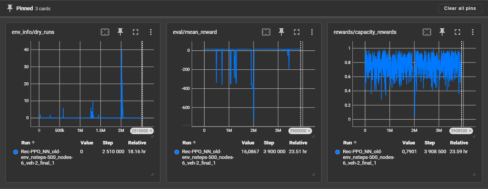
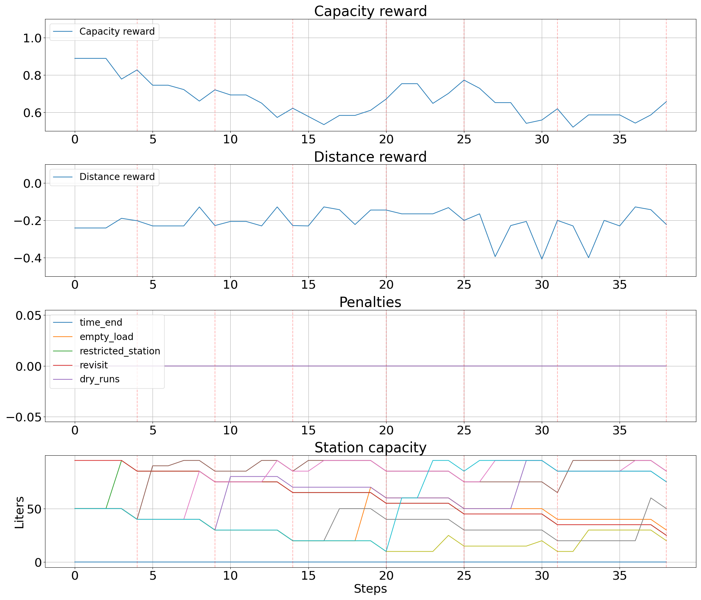

# Requirements

* gym
* torch
* gymnasium
* sb3_contrib
* tensorboard
* torch_geometric
* stable-baselines3[extra]

---

# Data for Model

Данные подаются в формате `.pkl`, который содержит `tuple` из 11 атрибутов. Каждый из них представлен в формате `torch.Tensor`. Эти данные используются для обучения модели и описывают параметры задачи. Ниже представлен формат данных:

1. **positions (позиции):**  
   Двумерный тензор размера `(n, 2)` с координатами точек.  
   Пример:
   ```python
   tensor([[274., 149.],
           [ 82., 223.],
           [ 94.,  49.]], dtype=torch.float64)
   ```

2. **weight_matrixes (матрицы весов):**  
   Квадратная матрица размера `(n, n)` с весами (например, расстояния между точками).  
   Пример:
   ```python
   tensor([[    0., 12300., 12300.],
           [12300.,     0., 10440.],
           [12300., 10440.,     0.]], dtype=torch.float64)
   ```

3. **daily_demands (ежедневные запросы):**  
   Трехмерный тензор размера `(d, n, 2)`, где `d` — количество дней, `n` — количество точек, `2` — параметры запросов.  
   Пример:
   ```python
   tensor([[[ 0.,  0.], 
            [10., 10.],
            [10., 10.]],
           ...
           [[ 0.,  0.],
            [10., 10.],
            [10., 10.]]], dtype=torch.float64)
   ```

4. **depots (депо):**  
   Одномерный тензор с указанием номера узла депо.  
   Пример:
   ```python
   tensor([0.], dtype=torch.float64)
   ```

5. **working_time (рабочее время):**  
   Одномерный тензор с указанием рабочего времен в секундах.  
   Пример:
   ```python
   tensor([32400., 32400.], dtype=torch.float64)
   ```

6. **restriction_matrix (матрица ограничений):**  
   Целочисленный двумерный тензор, описывающий ограничения.  
   Пример:
   ```python
   tensor([[0, 0, 0],
           [0, 0, 0]], dtype=torch.int32)
   ```

7. **service_times (время обслуживания):**  
   Одномерный тензор с временем обслуживания для каждой точки.  
   Пример:
   ```python
   tensor([900., 900., 900.], dtype=torch.float64)
   ```

8. **min_capacities (минимальная вместимость):**  
   Двумерный тензор размера `(n, 2)` с минимальными значениями, ниже которых нельзя опускаться.  
   Пример:
   ```python
   tensor([[0., 0.],
           [5., 5.],
           [5., 5.]], dtype=torch.float64)
   ```

9. **max_capacities (максимальная вместимость):**  
   Двумерный тензор размера `(n, 2)` с максимальными значениями вместимости.  
   Пример:
   ```python
   tensor([[ 0.,  0.],
           [95., 95.],
           [95., 95.]], dtype=torch.float64)
   ```

10. **init_capacities (начальная вместимость):**  
    Двумерный тензор размера `(n, 2)` с начальными значениями вместимости.  
    Пример:
    ```python
    tensor([[ 0.,  0.],
            [50., 50.],
            [50., 50.]], dtype=torch.float64)
    ```

11. **vehicle_compartments (отсеки транспортных средств):**  
    Трехмерный тензор размера `(v, n, 2)`, где `v` — количество транспортных средств.  
    Пример:
    ```python
    tensor([[[50., 50.],
             [50., 50.],
             [50., 50.]],
            [[50., 50.],
             [50., 50.],
             [50., 50.]]], dtype=torch.float64)
    ```

# Example usage

## Model Training

```bash
python train.py --n 3 --veh 2 --n_steps 500 --timesteps 10000
```

### Result

Run `tensorboard --logdir ppo_tensorboard` to monitor the training progress and view the prediction results.



## Model Eval

```bash
python eval.py --n 3 --veh 2 --n_steps 500
```

### Result




## Possible parameters:
```
 --n [3, 4, 5, 6, 7, 8, 9, 10] - Number of nodes
 --veh [2, 4, 6] - Number of vehicles
 --n_steps [250, 500, 1000] - Number of steps
 --timesteps - Number of training steps
 --pre_train [True, False] - Loading a pre-trained model
```
